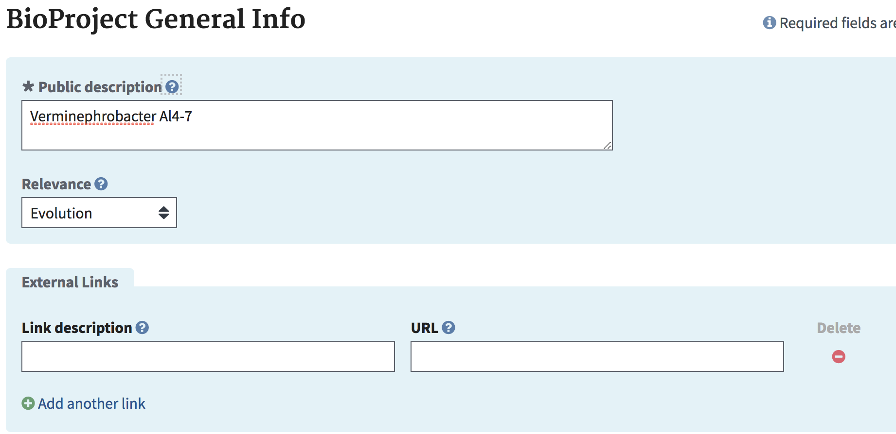
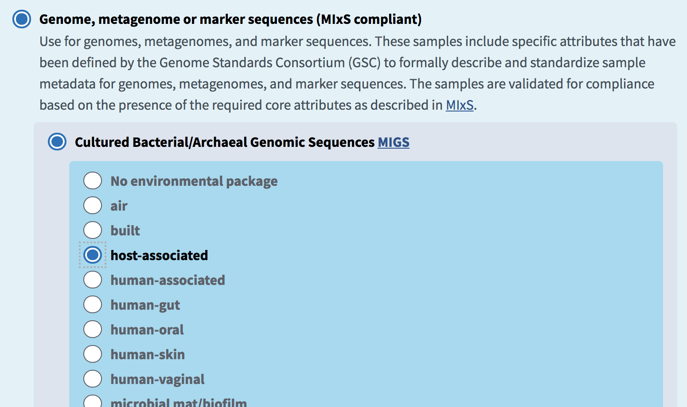
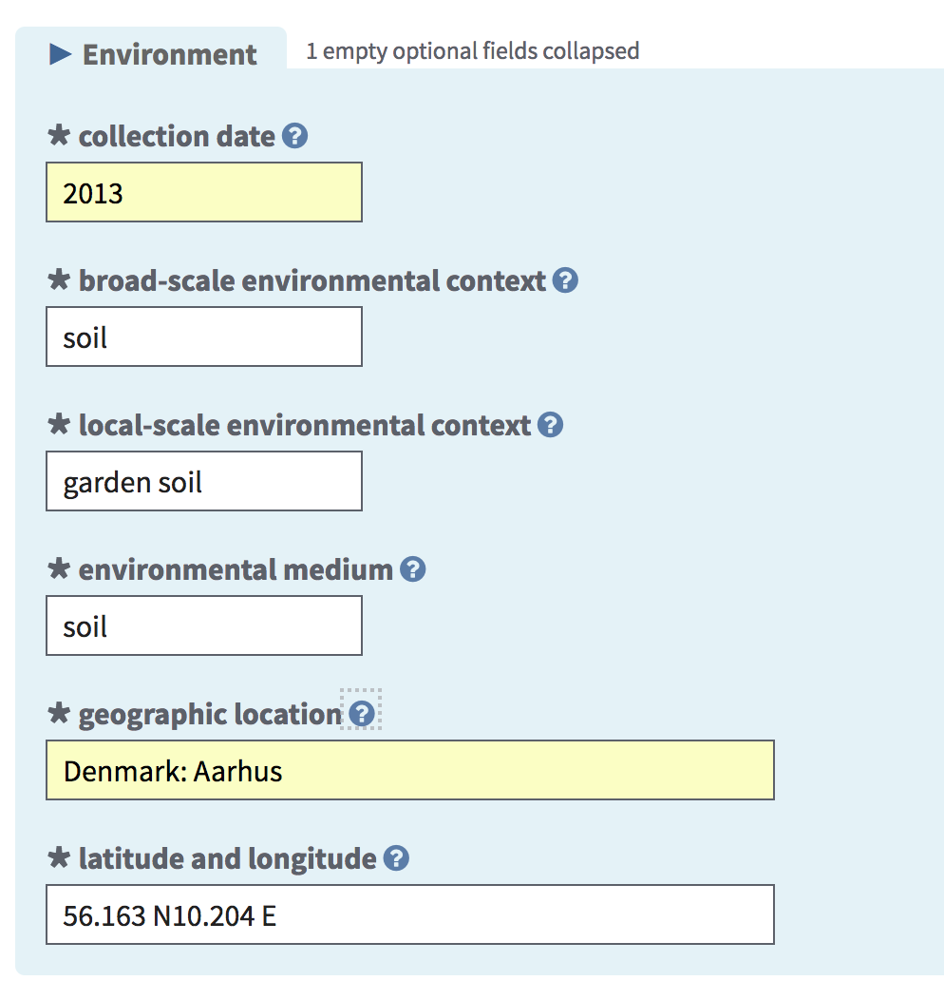
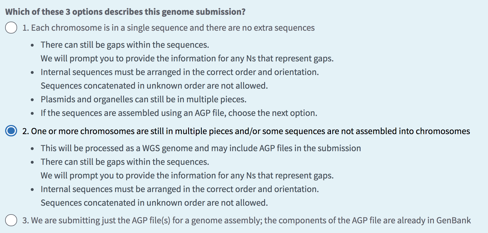
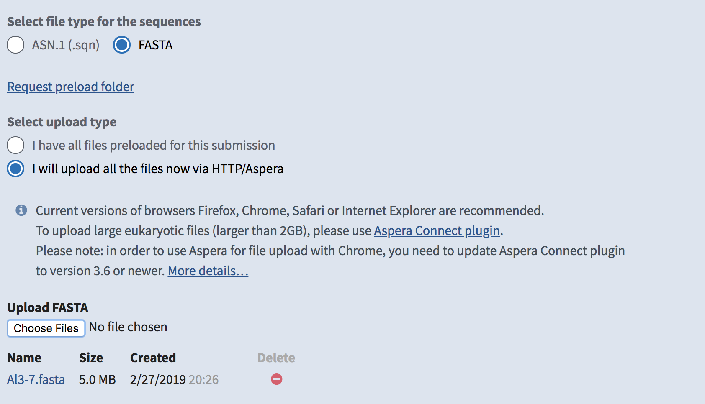
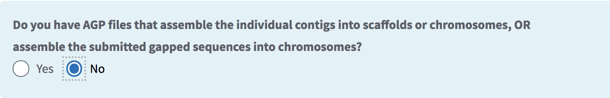
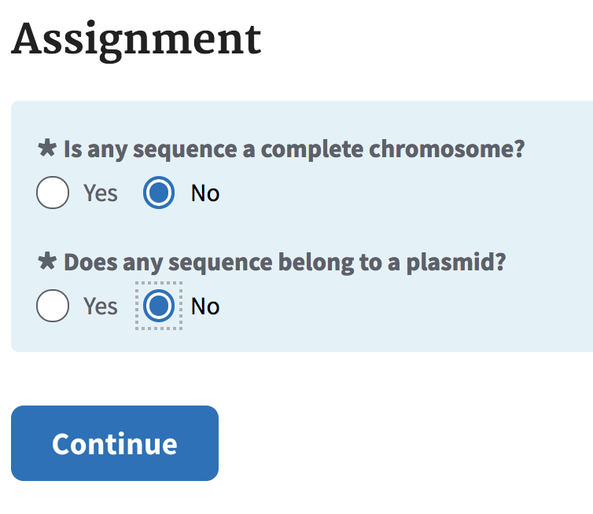
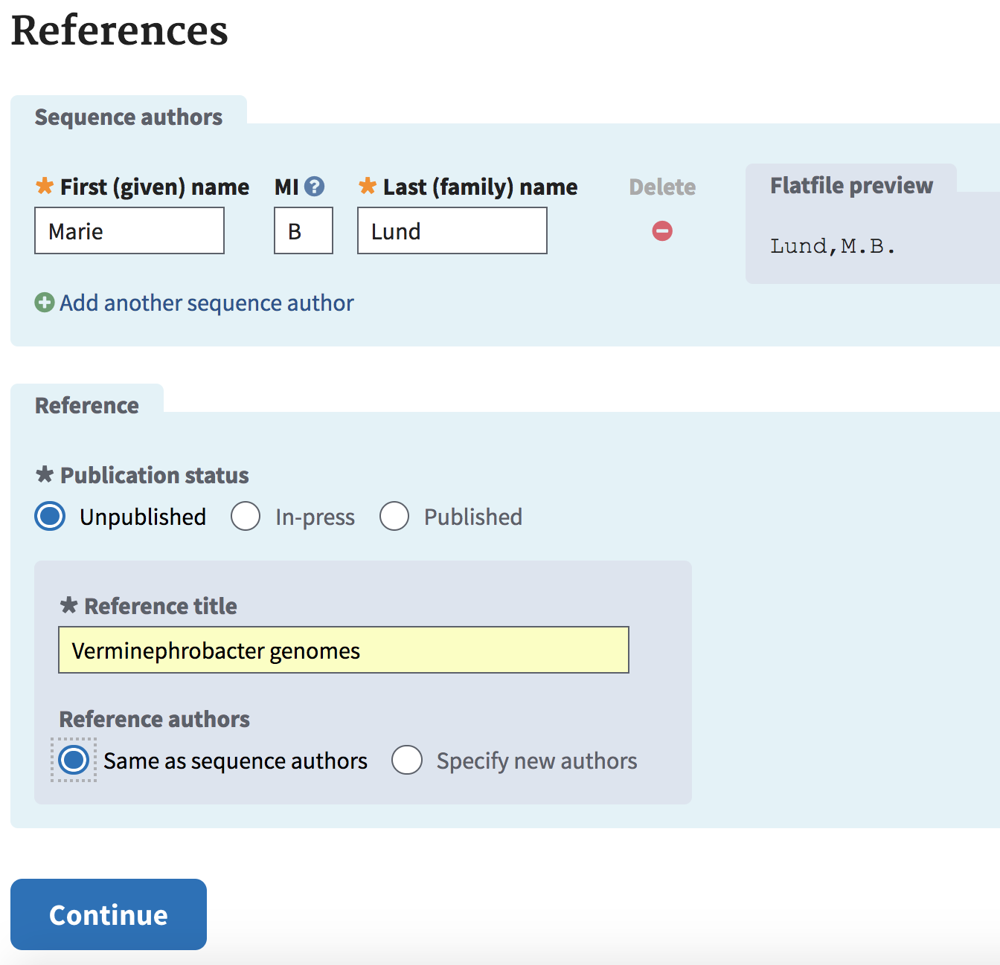

### Molecular Microbiology 2022
### Bioinformatics Protocol 11
# Submitting assembled genomes to NCBI

This protocol covers the submission of assembled prokaryotic genomes to [NCBI](http://ncbi.nlm.nih.gov) as a Whole-Genome Shotgun (WGS) project.

1. If you haven't already done so, download the `fasta` file containing your decontaminated scaffolds (or scaffolds from your raw spades assembly if no decontamination was necessary) to your own computer. The `.fna` file from your prokka annotation directory is the same thing.

2. Open the `fasta` file in Sublime Text and check for any scaffolds less than 200 bp in length (the `length_X` in each scaffold's name will tell you its length). Delete any scaffolds shorter than 200 bp and save the file.

3. Open a web browser and go to [https://submit.ncbi.nlm.nih.gov/subs/genome/](https://submit.ncbi.nlm.nih.gov/subs/genome/). Click *Login*. If you have a Google account you can log in using that, otherwise you will need to register for an NCBI account.

4. Click *New submission*.  

5. Select *Single Genome* and click *Continue*.  

6. Enter your personal contact details, AU Biology, and click *Continue*. You need to include an AU email address in at least one of these email fields.  

7. Select the following options then continue.  

8. Enter information about your Genome Assembly.  

9. Tell NCBI that this is a full genome, and name your submission with the full binomial name for your species followed by strain ID (e.g. "Pseudomonas stutzeri IC-126"), then click continue. Groups using their own strains from Microbial Physiology use a strain ID "MM2021_X" where X is your group number, otherwise choose the existing strain ID.

10. Give the organism a public name the same as your submission name, and select what "relevance" your study has from the drop-down menu. You should decide on the relevance based on the background of your organism.  

11. Select an appropriate submission package for your genome depending on the kind of sample it was isolated from. This will determine the kind of metadata to be included in your submission (see below).  

12. After adding the relevant metadata, you need to specify where the strain is available (enter the name of the relevant P.I., i.e. Kai Finster) and specify the yes, we would like to have the genome annotated.  

13. Now select some final options and (finally!) upload your `fasta` file from step 2. Be sure to have the instructor check your submission details before you upload!  

14. Finally, specify the authors of your submission (your group members, Ian P.G. Marshall, and Kai Finster). Under *Reference title* since there's no publication associated with this, you should give it a name that makes since ("Draft genome sequence of Bacillus magnificus MM2021_2" or something along those lines).  
